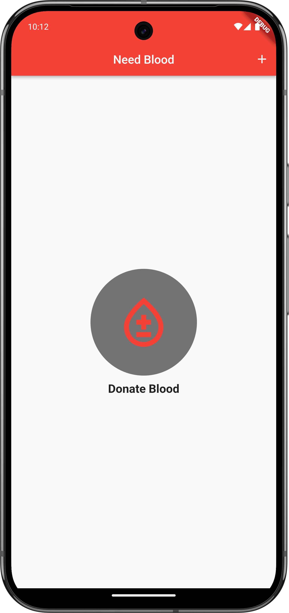

# Blood Donete -  Icon App In Flutter


## Screenshots



## Getting Started

### Prerequisites

- Flutter SDK (latest stable version)
- Android Studio / VS Code
- Git

### Installation

1. Clone the repository
```bash
git clone https://github.com/siraajul/blood_donate_live.git
```

2. Navigate to the project directory
```bash
cd blood_donate_live
```

3. Install dependencies
```bash
flutter pub get
```

4. Run the app
```bash
flutter run
```

## Project Structure

```
lib/
  ├── screens/         # UI screens
  └── main.dart      # Entry point
```

## Tech Stack
- Flutter

## Contributing

Contributions are welcome! Please feel free to submit a Pull Request.

## License

This project is licensed under the MIT License - see the [LICENSE](LICENSE) file for details.


## Contact

Your Name - [@siraaajul](https://twitter.com/siraaajul)

Project Link: [https://github.com/siraajul/blood_donate_live](https://github.com/siraajul/blood_donate_live)